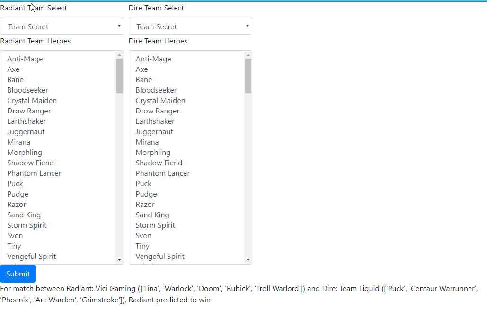
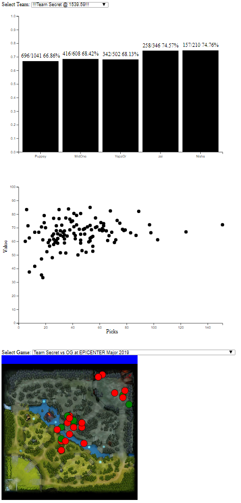

# Dota2 match prediction

After scraping opendota.com for pro team match history, I ran several classification algorithms to attempt to fit the hero picks and teams to predict which team will win.

# Dota2 pro team info

Combining requests, plotly, and D3 to graph pro teams' players' win rates, the teams' hero win rates, and animated/timed plots of team fights of recent matches

## Flask app

There's some excess files, but app.py runs a flask server. The main index runs the match predictions. The "/teamviz" path runs the info page.

## Libraries Used
Pandas, XGBoost, SKLearn, keras, Matplotlib, Pymongo, datetime, numpy, scipy, random, pickle

## Files in repo:
4 .json files can be imported into MongoDB
collect_data.py was used to create the dataset for match prediction. It is built so if it errors, it does not re-request matches that are already in the DB. Also does not re-request if the same match comes up in the list for two different teams (if they played each other).
app.py runs the flask app. It also has routes for the original data collection for team info, team hero info, player info. 
model.pickle.dat is the final predictor used for the flask app
